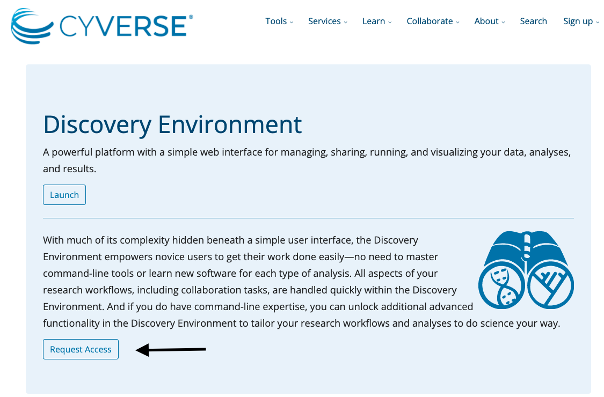

---

> **Access the Maine-eDNA Project Site [here](https://umaine.edu/edna/).**

The purpose of this site is to provide an overview, helpful information, and setup guidelines to prepare you for the Metabarcoding workshop.

 

# Schedule
---
 

10:00am - 12:00pm
 - Data Quality 
 - Filtering
 - Denoising using Dada2
  
_**1hr Lunch Break and Troubleshooting**_

 1:00pm - 3:00pm
 - Taxonomic Assignment
 - Visualization
 
  
  
 

# Software Install
---

 

### 1) CyVerse Account and VICE Access
> Required for workshop

 - For this workshop, we are going to be running the analysis workflow through the CyVerse Visual and Interactive Computing Environment (VICE). CyVerse is an open science workspace funded by NSF that allows you to run analysis and manage all your data and research in one place. The VICE environment is the latest feature in CyVerse's Discovery Environment (DE) for running interactive applications. This workshop will be using a custom built application that runs a containerized environment of software and dependencies using the RStudio interface. 

 - You can sign up for a free account by going to the Cyverse website <https://cyverse.org/> and clicking on the blue 'Create Account' box.
 - Once registered, request access to the Discovery Environment by clicking on the 'Request Access' box on this page as shown below <https://cyverse.org/discovery-environment>.
 - For more details and beginner documentation on using CyVerse, you can read the docs here <https://learning.cyverse.org/en/latest/>.

 

 

### 2) Slack 
> Required for workshop

 - We will be using Slack for all correspondence before, during, and after the workshop. This platform will allow participants to collaborate and ask questions with other workshop participants and organizers, get help with techinical questions, and post relevant content and material. Slack will be our only mode of communication during the workshop, as we will not be using the chat feature on Zoom, so this software will be **_required_** for the workshop. 
 
 - You can sign up for a free account on the Slack website <https://slack.com/>. 
 - Once registered, you can join the Maine-eDNA channel at the link below. You will be added to two channels: 1. #metabarcoding-workshop-2021: here you will find all pre-workshop communication and general chat information, 2: #help: here you can ask technical questions before, during, or after the workshop
  
 
 > <https://join.slack.com/t/maine-ednaworkspace/shared_invite/zt-yu1aprwk-PyI3gGz_MKJ5RsJoRcSSgQ>.
 
 

 

### 3) R and RStudio
>Not required to install prior to workshop, but we will be using these programming tools, if you would like to become familiar with it before the workshop.

* R Version 4.1.2

  - R is a free software environment for statistical computing and graphics. It compiles and runs on a wide variety of UNIX platforms, Windows and MacOS. To download R, you can access the installers here <https://www.r-project.org/>.
 

* RStudio Version 1.4

  - RStudio is an integrated development environment (IDE) for R. It includes a console, syntax-highlighting editor that supports direct code execution, as well as tools for plotting, history, debugging and workspace management. There are two versions available for download: RStudio Desktop and RStudio Server, which can be accessed here <https://www.rstudio.com/>. RStudio Desktop is a regular desktop application while RStudio Server runs on a remote server and allows accessing RStudio using a web browser. For beginner users, we recommend the RStudio Desktop version.

 
 

 
