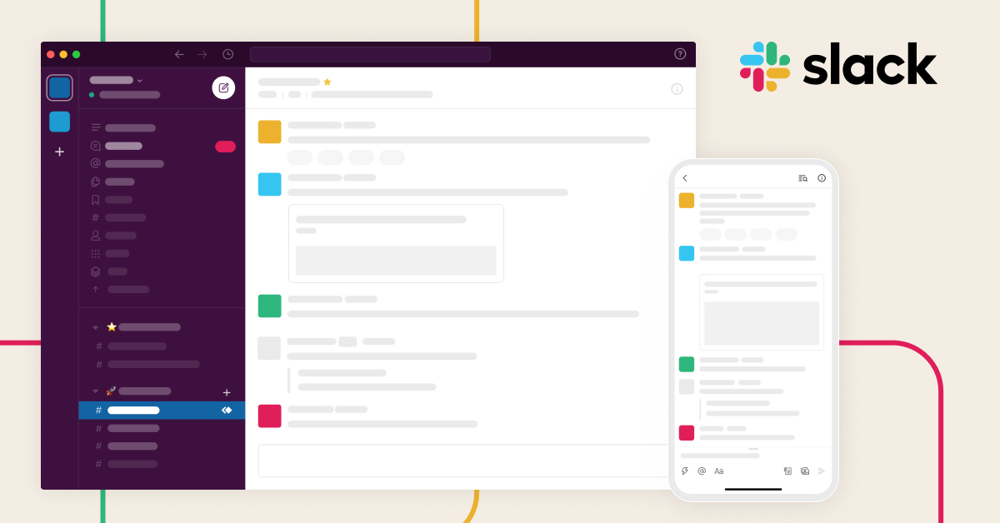

---

> **Access the Maine-eDNA Project Site [here](https://umaine.edu/edna/).**

The purpose of this site is to provide an overview, helpful information, and setup guidelines to prepare you for the Metabarcoding workshop.

 

# Schedule

10:00am - 12:00pm
 - Data Quality Filtering/Dada2
 
 > 1hr Lunch Break and Troubleshooting
 
 1:00pm - 3:00pm
 - Taxonomic Assignment and Plotting
 
  
  
 

# Software Install
---

### 1) R and RStudio
* R Version XXXX

* RStudio Version XXXX

 
 

 

### 2) Slack

 - Instructions for Slack channel here
 
 

 
