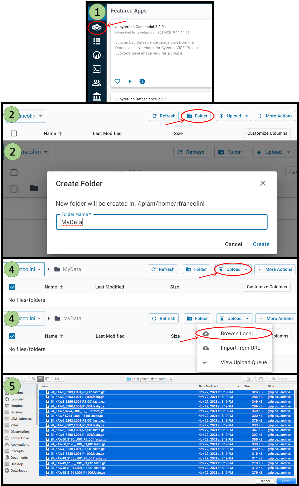

 
## Tutorials

Here are some additional recommended tutorials for metabarcoding data analysis

- [Happy Belly Bioinformatics - Amplicon analysis](https://astrobiomike.github.io/amplicon/)

- [Benjamin Callahan - Dada2 Tutorial](http://benjjneb.github.io/dada2/)

- [Qiime2 - Moving Pictures Tutorial](https://docs.qiime2.org/2021.8/tutorials/moving-pictures/)

 
## Uploading Data onto CyVerse

If you are interested in continuing working within the CyVerse environment with your own data, follow the instructions below to upload your data onto the server:

1. Choose the data panel on the left
2. Click the Folder button to create a new folder that will hold your reads
3. Navigate to the newly created folder
4. Click Upload then choose "Browse Local"
5. Select files on your computer to be uploaded then choose "Open"
7. Files will start uploading (this can take time if there are large files)

 
## Publications

[Callahan et al., 2016. DADA2: High-resolution sample inference from Illumina amplicon data. _Nature Methods_ 13: 581-583.](https://www.nature.com/articles/nmeth.3869)

[Deiner et al., 2017. Environmental DNA metabarcoding: Transforming how we survey animal and plant communities. _Molecular Ecology_ 26(21): 5872-5895.](https://onlinelibrary.wiley.com/doi/10.1111/mec.14350)

[Kaehler et al., 2019. Species abundance information improves sequence taxonomy classification accuracy. _Nature Communications_ 10: 4643.](https://www.nature.com/articles/s41467-019-12669-6)

[Liu et al., 2019. A practical guide to DNA metabarcoding for entomological ecologists. _Ecological Entomology_ 45(3): 373-385.](https://onlinelibrary.wiley.com/doi/10.1111/een.12831)

[Robeson II et al., 2021. RESCRIPt: Reproducible sequence taxonomy reference database management. _PLoS Computational Biology_ 17(11): e1009581.](https://journals.plos.org/ploscompbiol/article?id=10.1371/journal.pcbi.1009581)

[Ruppert et al., 2019. Past, present, and future perspectives of environmental DNA (eDNA) metabarcoding: A systematic review in methods, monitoring, and applications of global eDNA. _Global Ecology and Conservation_ 17: e00547.](https://www.sciencedirect.com/science/article/pii/S2351989418303500)