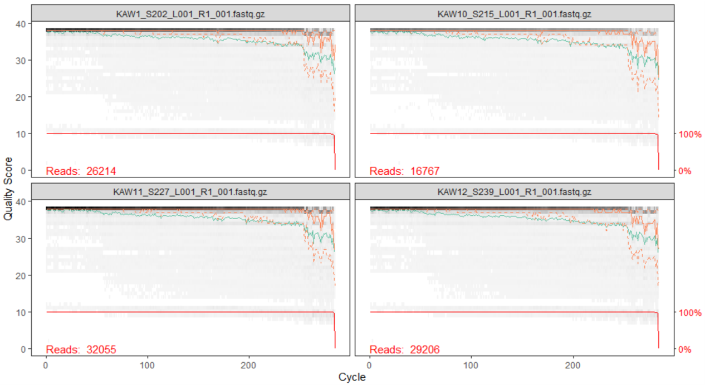
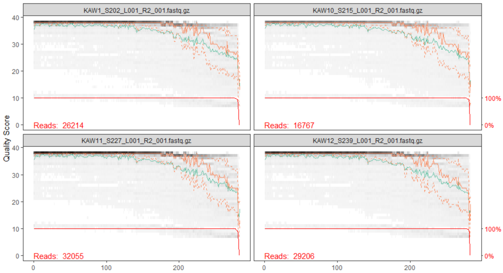
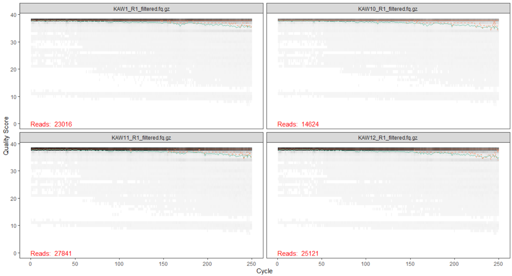
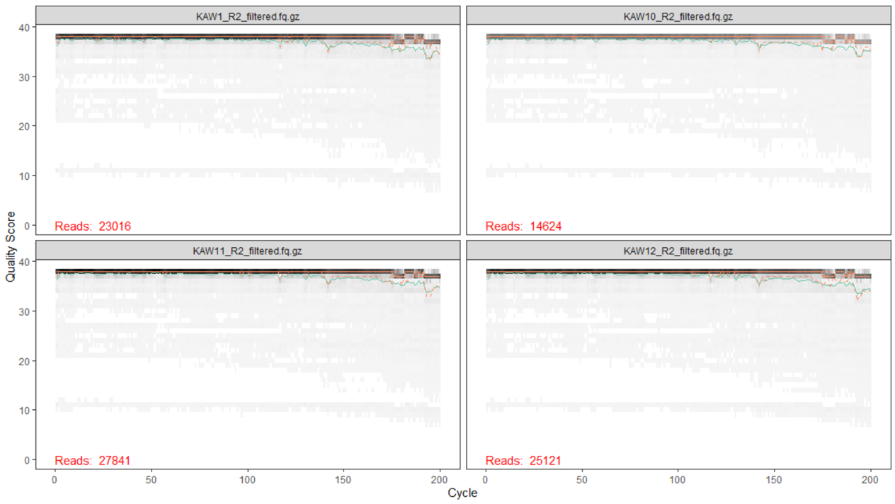
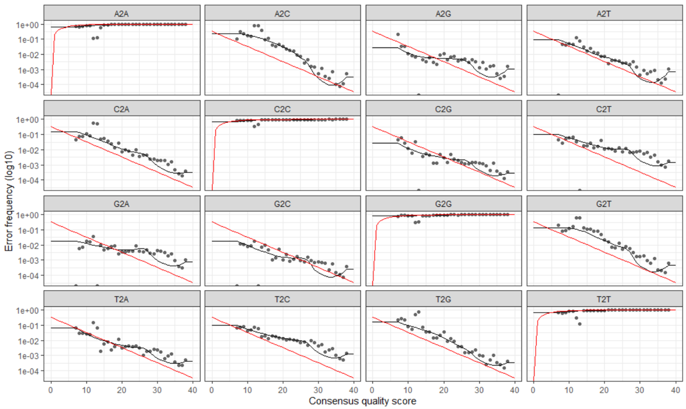

---
<br>

# Pipeline Initial Assumptions
This workflow assumes that your sequencing data meets certain criteria:
- 
- 


 
<br>
<br>
<br>

---


<br>
<br>

# Working environment
If wanting to follow along, we can work on our own system if we'd like, or we can work in a "Binder" without needing to worry about setting up the appropriate environment on our own system (see next section, [Binder available](#binder-available)).

### Binder available
[Binder](https://mybinder.org/){:target="_blank"} 


<br>

## Conda setup
> **NOTE**  
> Skip this section if working in the binder environment from above. 

<br>

# Data Overview

Highland lakes info here.....

<br>
<br>


### Getting the data

At this point, we are assuming that the Highland Lake data lives in a directory named `MetabarcodingWorkshop`, and that the forward reads are in files labeled with `R1`, and each has a cooresponding reverse read file that is labeled with `R2`.

Now, let's get started!

<br>

---
<br>

# Processing overview

>**Note**  
> There may be some slight differences in numbers in places due to differences in program versions between when this page was initially put together and what is in either the binder or conda environment. So don't worry if you are seeing something slightly different than what's noted or pictured anywhere below.


||Command|What it's doing|
|:--:|:--------:|----------|
|1|`fastqc`|check the quality of the sequencing data (fastqc)|
|2|`cutadapt`|remove primers and trim/filter reads (cutadapt)|
|3|`plotQualityProfile` |inspect quality of reads (dada2)|
|4|`filterAndTrim()`|quality filter and trim reads (dada2)| 
|5|`learnErrors()`|generate an error model of our data (dada2)|
|6|`derepFastq`|dereplicate sequences (dada2)|
|7|`dada()`|infer ASVs on both forward and reverse reads independently (dada2)|
|8|`mergePairs()`|merge forward and reverse reads to further refine ASVs (dada2)|
|9|`makeSequenceTable()`|generate a count table (dada2)|
|10|`removeBimeraDenovo()`|screen for and remove chimeras (dada2)|
|11|`IdTaxa()`|assign taxonomy (dada2)|

<br>

## Check Data Quality
The first step we are going to do is check the quality of our data using fastqc. To run this analysis on a single file, you can run `fastqc filename.fastq.gz`, where `filename` is the name of the file. However, you can also choose to run this on all of the sequence files in your directory like so: `fastqc *.fastq.gz`. The output file is an html that you can easily view.

***INSERT FASTQC SCREENSHOT HERE***

Above is a screenshot of the fastqc result for the forward and reverse files of two of the samples from our Highland Lake dataset. 
***FILL IN WITH COMMENTS ON FASTQC RESULT FOR HIGHLAND LAKE***

<br>

## Remove Primers

Our next step is to remove the primers from our sequences using cutadapt. Cutadapt will be handed multiple arguments followed by the files you are running this operation on. The arguments we will use are as follows (you can learn more options via cutadapt's documentation):

- **-a:** The primers that you expect to see in your forward read. Since we are working with sequences where you may find part of your reverse primer in your reads, we will hand cutadapt the forward primer (5' - 3') as well as the reverse complement of your reverse primer, linked with three dots between the two. With this linked option, cutadapt will expect to see your "anchored" primer (in this case, your forward primer), but if it sees any or all of your reverse primer, it will remove that as well. `-a ^FORWARD...REVERSECOMP_REVERSE`
- **-A:** Similar to above, the primers that you expect to see in your reverse read. In this case, we will hand cutadapt the reverse primer (5' - 3') as well as the reverse complement of your forward primer, linked with three dots between the two. With this linked option, cutadapt will expect to see your "anchored" primer (in this case, your reverse primer), but if it sees any or all of your forward primer, it will remove that as well. `-A ^REVERSE...REVERSECOMP_FORWARD`
- **-m:** Minimum read length, often good to set this below what you expect the minimum length of your reads to be. `-m MIN_NUMBER`
- **-M:** Maximum read length, often good to set this above what you expect the maximum length of your reads to be. `-m MAX_NUMBER`
- **--discard-untrimmed:** This will throw away any read pairs that do not have either the forward primer in the forward read or the reverse primer in the reverse read. 
- **-o:** output file for the forward reads. `-o R1.outputfile.fq.gz`
- **-p:** output file for the reverse reads. `-p R2.outputfile.fq.gz`
- **input file:** file name for forward reads. `forwardinput.fq.gz`
- **output file:** file name for reverse reads. `reverseinput.fq.gz`

Cutadapt only works on one file at a time. Therefore, when we would like to run this operation on our entire dataset, we wrap it in a loop to do so easily. 
***HOW DO WE WANT TO TALK ABOUT MAKING A FILE WITH FILENAMES, R OR COMMANDLINE?***

***CHECK THIS CODE TO MAKE SURE IT MATCHES HOW WE WOULD RUN IT FOR HIGHLAND LAKE SET***
```bash
for sample in $(cat samples)
do

    echo "On sample: $sample"
    
    cutadapt -a ^CYGCGGTAATTCCAGCTC...CRAAGAYGATYAGATACCRT \
    -A ^AYGGTATCTRATCRTCTTYG...GAGCTGGAATTACCGCRG \
    -m 150 -M 550 \
    --discard-untrimmed \
    -o ${sample}_R1_trimmed.fastq.gz \
    -p ${sample}_R2_trimmed.fastq.gz \
    ${sample}_R1.fastq.gz \
    ${sample}_R2.fastq.gz >> Cutadapt_trimming_stats.txt 2>&1

done
```

In the above loop, after passing cutadapt the listed arguments as well as the forward and reverse files we wanted it to run on, we then directed the stats output to be stored in the file `Cutadapt_trimming_stats.txt`. We can take a look at this file to get an idea of how many reads were recovered after this trimming step.

***VISUAL OF CUTADAPT OUTPUT?***

***DO WE RUN FASTQC AGAIN AS WELL CAUSE THERE IS A QUALITY PLOT THERE OR JUST DO QUALITY PLOT SEPERATELY?***

<br>


## Setting Up R Environment

From here on out, we will be working in R. Thus, the first step is to ensure we have the dada2 package loaded in our environment and that our working directory is the directory containing our fastq files that have been processed through cutadapt.

``` R
library(dada2)
packageVersion("dada2") 
#1.18.0 for Rene when this was written in October 2021

```

Next, we will set up some variable names in our environment to make processing our samples easier.


``` R
#set this to the path where your fastq files live
path <- "MetabarcodingWorkshop/reads" 

list.files(path)
 ## Output:
 #[1] "KAW1_S202_L001_R1_001.fastq.gz" 
 #[2] "KAW1_S202_L001_R2_001.fastq.gz" 
 #[3] "KAW10_S215_L001_R1_001.fastq.gz"
 #[4] "KAW10_S215_L001_R2_001.fastq.gz"
 #[5] "KAW11_S227_L001_R1_001.fastq.gz"
 #[6] "KAW11_S227_L001_R2_001.fastq.gz"
 #... should have 98 files

forward_reads <- sort(list.files(path, pattern="_R1_001.fastq.gz", full.names = TRUE))

reverse_reads <- sort(list.files(path, pattern="_R2_001.fastq.gz", full.names = TRUE))

samples <- sapply(strsplit(basename(forward_reads), "_"), `[`, 1)

 ##Global Environment:
 # forward_reads    chr [1:49] "reads/KAW1_S202_L001_R1_001.fastq.gz"...
 # reverse_reads    chr [1:49] "reads/KAW1_S202_L001_R2_001.fastq.gz"...
 # samples          chr [1:49] "KAW1" "KAW10" "KAW11" "KAW12"...

```

Now that we have these variables set up, we can proceed with our data processing!!

<br>

## Quality Plot Inspection

Let's first take a look at what the quality of our data looks like now. Instead of running fastqc as we did at the beginning, we can use the dada2 function `plotQualityProfile`.

```R
# to run a subset of the reads, select which with square brackets
# below we are only running the first four in the list we previously created
plotQualityProfile(forward_reads[1:4])
plotQualityProfile(reverse_reads[1:4])
```

Below is the output of the first four forward reads:

<center></center>

Below is the output of the first four reverse reads:

<center></center>

When reading these plots, you will find the bases are along the x-axis and the quality score is on the y-axis. The black underlying heatmap shows the frequency of each score at each base position, the green line is the median quality score at that base position, and the orange lines show the quartiles.

A quality score of 30 is equal to an expected error rate of 1 in 1,000, and this will be the cutoff we use in our analysis. Looking at the above graphs, you will see that overall the quality looks good. The forward reads maintain a high quality until around 250bp, while the reverse reads maintain a high quality until around 200bp. The fact that the reverse read drops in quality before the forward read does should not be of concern, as this is a common occurrence with chemistry.

<br>

## Filter and Trimming

With the knowledge that viewing our quality plots has provided, we will now trim our reads so we are working with the highest quality basepairs moving forward.

First, we will create a new set of variables for our filtered reads to be assigned to.

```R
filtered_forward_reads <- paste0(samples, "_R1_filtered.fq.gz")
filtered_reverse_reads <- paste0(samples, "_R2_filtered.fq.gz")

 ##Global Environment:
 # filtered_forward_reads    chr [1:49] "KAW1_R1_filtered.fq.gz" ...
 # filtered_reverse_reads    chr [1:49] "KAW1_R2_filtered.fq.gz" ...
```

Next, we will run the `filterAndTrim()` function to trim our reads based on our quality filter of 30 and above, passing the function our input files, output file name, and a few parameters. The parameters we will use are as follows:

- **forward reads input:** input files for forward reads
- **forward reads output:** output files for forward reads
- **reverse reads input:** input files for reverse reads
- **reverse reads output:** output files for reverse reads
- **maxEE:** the maximum amount of erroneous errors in each read. This is passed to R as a vector of two values, one for forward and one for reverse `c(ForwardValue, ReverseValue)`.
- **minLen:** the minimum length the reads can be after trimming. You want to ensure that there will be enough overlap between the forward and reverse reads after trimming them. 
- **truncLen:** the length to trim the forward and reverse reads to, based on your analysis of the quality plots from before. This is passed to R as a vector of two values, as the forward reads will often be of higher quality for a longer length than the reverse reads will be `c(ForwardValue, ReverseValue)`.

For our Highland Lake data, we run this function as follows:

```R
filtered_out <- filterAndTrim(forward_reads, 
                              filtered_forward_reads,
                              reverse_reads, 
                              filtered_reverse_reads, 
                              maxEE=c(2,2),
                              minLen=175, 
                              truncLen=c(250,200))
                        
 ##Global Environment:
 # filtered_out     num [1:49, 1:2] 26214 16767 32055 29206 25789 ...
```

The `filtered_out` matrix we created has each sample name, the number of reads it originally had, and the number of reads it has now that the samples have been filtered. We can look at that to see the difference in counts before and after.

```R
filtered_out
                        
#                                  reads.in reads.out
# KAW1_S202_L001_R1_001.fastq.gz     26214     23016
# KAW10_S215_L001_R1_001.fastq.gz    16767     14624
# KAW11_S227_L001_R1_001.fastq.gz    32055     27841
# KAW12_S239_L001_R1_001.fastq.gz    29206     25121
# KAW13_S251_L001_R1_001.fastq.gz    25789     22684
```

Another thing we can look at is a quality plot! Similar to before, we can run `plotQualityProfile` on our trimmed and filtered data to verify that the quality of our reads are what we expect them to be.

```R
plotQualityProfile(filtered_forward_reads[1:4])
plotQualityProfile(filtered_reverse_reads[1:4])
```

Below is the output of the first four forward reads:

<center></center>

Below is the output of the first four reverse reads:

<center></center>

<br>

## Generate Error Model

Next, we want to create an error model for our dataset, as DADA2 relies on a parametric error model. Each dataset has it's own error profile, and the `learnErrors()` function learns the error rate for both the forward and reverse reads of your dataset.

```R
err_forward_reads <- learnErrors(filtered_forward_reads)
err_reverse_reads <- learnErrors(filtered_reverse_reads)

#set multithread = TRUE if running on your own system:
#err_forward_reads <- learnErrors(filtered_forward_reads, multithread = TRUE)
#err_reverse_reads <- learnErrors(filtered_reverse_reads, multithread = TRUE)

 ##Global Environment:
 # err_forward_reads        List of 3
 # err_reverse_reads        List of 3
```

We can visualize our model with the `plotErrors()` function.

```R
plotErrors(err_forward_reads, nominalQ=TRUE)
plotErrors(err_reverse_reads, nominalQ=TRUE)
```

Below is the graph of our forward error plot (reverse looks very similar):

<center></center>

***FOLLOWING PARAGRAPH IS STOLEN AND SHOULD BE REWRITTEN***
The error rates for each possible transition are shown. Points are the observed error rates for each consensus quality score. The black line shows the estimated error rates after convergence of the machine-learning algorithm. The red line shows the error rates expected under the nominal definition of the Q-score. Here the estimated error rates (black line) are a good fit to the observed rates (points), and the error rates drop with increased quality as expected. Everything looks reasonable and we proceed with confidence.

<br>

## Dereplication

Dereplication combines identical sequences into one sequence with an abundance count to keep track of how many of those reads existed. The quality score of this representative sequence is assigned the average value of the quality scores of all the identical sequences. This speeds up the computation time in the following steps, as it will elimate the need to compute across redundant samples.

```R
derep_forward <- derepFastq(filtered_forward_reads, verbose=TRUE)
names(derep_forward) <- samples 
derep_reverse <- derepFastq(filtered_reverse_reads, verbose=TRUE)
names(derep_reverse) <- samples

 ##Global Environment:
 # derep_forward            Large list (49 elements, 972.1 MB)
 # derep_reverse            Large list (49 elements, 642.8 MB)
```

<br>

## Inferring ASVs

Now it is time to infer true biological sequences - the main inference algorithm of DADA2. DADA2 uses quality profiles and abundances of each unique sequence to figure out if each sequence is more likely to be of biological origin or spurious. You can read more on the DADA2 site.

```R
dada_forward <- dada(derep_forward, err=err_forward_reads, pool="pseudo")
dada_reverse <- dada(derep_reverse, err=err_reverse_reads, pool="pseudo")

#set multithread = TRUE if running on your own system:
#dada_forward <- dada(derep_forward, err=err_forward_reads, pool="pseudo", multithread = TRUE)
#dada_reverse <- dada(derep_reverse, err=err_reverse_reads, pool="pseudo", multithread = TRUE)

 ##Global Environment:
 # dada_forward            List of 49
 # dada_reverse            List of 49
```

<br>

## Merging paired reads

We will now merge the forward and reverse reads to obtain our entire amplicons. DADA2 aligns the corresponding forward and reverse reads such that a required number of bases overlap perfectly. As a default, DADA2 requires 12 basepairs to overlap, however, to be more stringent, we can set the variable `minOverlap` to be a value of basepairs we expect our sequences to have based on our truncated lengths. The output of this process is are merged "contigs". If there are any reads that do not overlap perfectly at this step they are removed from the dataset.


```R
merged_amplicons <- mergePairs(dada_forward, 
                              derep_forward, 
                              dada_reverse,
                              derep_reverse, 
                              minOverlap=20)

 ##Global Environment:
 # merged_amplicons            Large list (49 elements, 19.1 MB)
                              
```

<br>

## Count Table and Summary

To summarize the workflow nicely, we will use the `makeSequenceTable()` function to make an ASV table. 

```R
seqtab <- makeSequenceTable(merged_amplicons)
dim(seqtab)
# 49 7082

##Global Environment:
 # seqtab            Lagre matrix (347018 elements, 4.6 MB)
```

While useful, the ASV table is not the easiest to read. Thus, we will mold the data a bit to make it more user-friendly.

First, we will identify chimeras. DADA2 identifies likely chimeras by aligning each sequence with those that were recovered in greater abundance and then seeing if there are any lower-abundance sequences that can be made exactly by mixing left and right portions of two of the more-abundant ones. By calculating the ratio of non-chimeras to total sequences, we can verify that we are not losing many samples by removign these chimeras.

```R
seqtab.nochim <- removeBimeraDenovo(seqtab, multithread=TRUE, verbose=TRUE)
# Identified 4787 bimeras out of 7082 input sequences.

dim(seqtab.nochim)
# 49 2295
sum(seqtab.nochim)/sum(seqtab)
# 0.9471908
```

Next, we will create a table with the count of sequences at each step of our pipeline and write it out to a file `read-count-tracking.tsv`.

```R
getN <- function(x) sum(getUniques(x))


summary_tab <- data.frame(row.names=samples, dada2_input=filtered_out[,1],
               filtered=filtered_out[,2], dada_f=sapply(dada_forward, getN),
               dada_r=sapply(dada_reverse, getN), merged=sapply(merged_amplicons, getN),
               nonchim=rowSums(seqtab.nochim),
               final_perc_reads_retained=round(rowSums(seqtab.nochim)/filtered_out[,1]*100, 1))

write.table(summary_tab, "read-count-tracking.tsv", quote=FALSE, sep="\t", col.names=NA)

##Global Environment:
 # summary_tab            49 obs of 7 variables
 
head(summary_tab)

#       dada2_input filtered dada_f dada_r merged nonchim final_perc_reads_retained
# KAW1        26214    23016  22749  22835  21544   19904                      75.9
# KAW10       16767    14624  14514  14528  13567   12605                      75.2
# KAW11       32055    27841  27683  27737  26860   25673                      80.1
# KAW12       29206    25121  24971  25015  22817   21942                      75.1
# KAW13       25789    22684  22496  22490  21523   19665                      76.3
# KAW14       30269    26219  25963  25958  24671   22486                      74.3

```

Now we have our ASVs ready to be assigned taxonomy so we can identify what is really existing in our samples!

<br>
<br>

## Assigning taxonomy


<br>
<br>

# Visualization with Phyloseq


<br>
<br>


