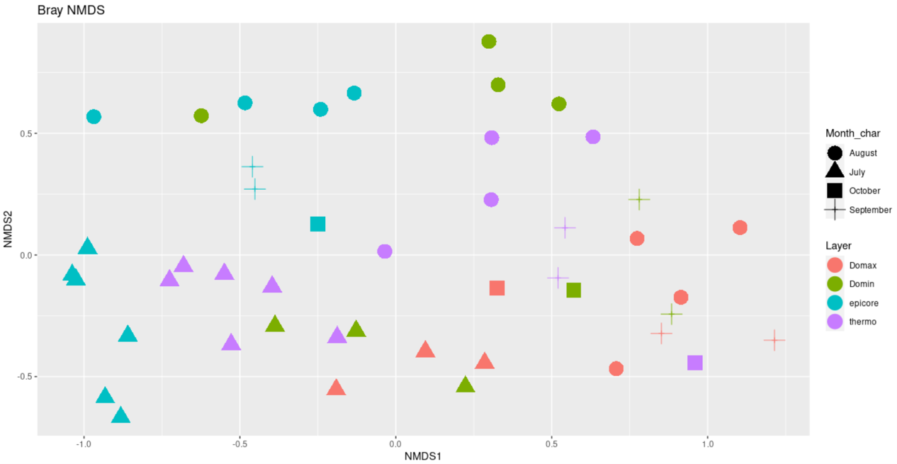

---
<br>

# Pipeline Initial Assumptions
This workflow assumes that your sequencing data meets certain criteria:
- You have paired-end sequences that are properly named (R1 and R2)
- Your sequences have been demultiplexed
- The primer sequences have not been removed from your sequences
- Your sequences are all in the same directory

---
---
<br>

# Set Up CyVerse Working Environment
We will be operating in CyVerse, a virtual environment that already has the programs and packages installed that this pipeline requires. By now, you should have gotten a CyVerse account and joined our workshop. First things first, lets set up our Discovery Environment that we will be working in today:

1. Log into CyVerse. You should now be at user.cyverse.org/services.
2. Under "My Services", click on "Discovery Environment".
3. Click "Launch". You should now be at de.cyverse.org.
4. Click the 9-square logo "Apps" button on the left.
5. Click on the dropdown menu to go to "shared with me" and choose "metabarcoding-maine".
6. Set up your environment:
  - Analysis Info: You can leave this all on default settings
  - Parameters: Click on "browse" for input folder, go to "Shared with me" and navigate to "robinsleith". Choose to input the **2K_Highland_18S** folder.
  - Advanced Settings: 4 CPU Cores, 4 GiB, 4 GiB
  - You're good to go! click "Launch Analysis".
7. The environment you just created should be at the top of your analysis list. On the right hand side, click on the logo of the box and arrow to open up the environment window. This may take a few moments, so be patient.

Once the app loads you will be greated by a familiar RStudio window.  We will be using this RStudio interface for the rest of the tutorial.  To get started, create a new RMarkdown file: go to `File > New File > R Markdown...`. Accept all the defaults, click "OK".  Now in the new R Markdown file delete everything and copy paste [this document](https://raw.githubusercontent.com/Maine-eDNA/bioinfo_training/main/HighlandLakeTutorial.Rmd){:target="_blank"} in. Save this R Markdown file (`File > Save`).  This R Markdown file has all the code needed to complete this tutorial. You are strongly encouraged to take your own notes in this R Markdown file as we go through the tutorial.

Now we need to create a few directories that we will use in this tutorial and copy the data from the "2K_Highland_18S"" directory (which is currently nested in our "work" directory) to our "raw_reads" directory. To do so, navigate to the **terminal** tab of the RStudio screen. You should be in your home directory (indicated by "~$") and run the following code:

```bash
mkdir fastqc
mkdir raw_reads
mkdir trimmed
mkdir filtered

cp work/2K_Highland_18S/* raw_reads
```

<br>

# Data Overview
We will be working with a dataset that was the result of a collaboration between Karen Wilson (USM) and Pete Countway (Bigelow). The dataset is from Highland Lake, a 640 acre lake in the Presumpscot River watershed. The lake has algal blooms that started in 2014 and much work has been done to understand the dynamics of these blooms and their connection to the reintroduction of alewife following a 2010 fishway restoration project. The data for this tutorial are from 2018 and represent 18S rRNA (SSU) metabarcoding, targeting the eukaryotic plankton in the lake. Samples were collected from a single site on 13 days from July to October at multiple depths. Samples were filtered on 0.2um Supor filters, DNA was extracted with the PowerWater DNA extraction kit and sequenced at IMR Dalhousie following their standard protocol.

**Now, let's get started!**

---
---
<br>

# Processing overview

||Command|What it's doing|
|:--:|:--------:|----------|
|1|`fastqc`|check the quality of the sequencing data (fastqc)|
|2|`cutadapt`|remove primers and trim/filter reads (cutadapt)|
|3|`plotQualityProfile` |inspect quality of reads (dada2)|
|4|`filterAndTrim()`|quality filter and trim reads (dada2)| 
|5|`learnErrors()`|generate an error model of our data (dada2)|
|6|`derepFastq`|dereplicate sequences (dada2)|
|7|`dada()`|infer ASVs on both forward and reverse reads independently (dada2)|
|8|`mergePairs()`|merge forward and reverse reads to further refine ASVs (dada2)|
|9|`makeSequenceTable()`|generate a count table (dada2)|
|10|`removeBimeraDenovo()`|screen for and remove chimeras (dada2)|
|11|`assignTaxonomy()`|assign taxonomy (dada2)|

<br>

## Check Data Quality
The first step we are going to do is check the quality of our data using fastqc. To run this analysis on a single file, you can run `fastqc filename.fastq.gz`, where `filename` is the name of the file. However, you can also choose to run this on all of the sequence files in your directory like so: `fastqc *.fastq.gz`. The output file is an html that you can easily view. We will run fastqc on all of our files, then move them to our fastqc directory.

```bash
fastqc raw_reads/*fastq.gz
mv raw_reads/*fastqc* fastqc
```

Now, if we navigate to our fastqc directory, there should be a .zip and .html fastqc file for each fastq file we have. To view the results, open one of the .html files and view in web browser.

Below is a partial screenshot of the fastqc result for the forward and reverse files of the first sample from our Highland Lake dataset. 

<center></center>

---
---
<br>

## Remove Primers

Our next step is to remove the primers from our sequences using cutadapt. Cutadapt will be handed multiple arguments followed by the files you are running this operation on. The arguments we will use are as follows (you can learn more options via cutadapt's documentation):

- **-a:** The primers that you expect to see in your forward read. Since we are working with sequences where you may find part of your reverse primer in your reads, we will hand cutadapt the forward primer (5' - 3') as well as the reverse complement of your reverse primer, linked with three dots between the two. With this linked option, cutadapt will expect to see your "anchored" primer (in this case, your forward primer), but if it sees any or all of your reverse primer, it will remove that as well. `-a ^FORWARD...REVERSECOMP_REVERSE`
- **-A:** Similar to above, the primers that you expect to see in your reverse read. In this case, we will hand cutadapt the reverse primer (5' - 3') as well as the reverse complement of your forward primer, linked with three dots between the two. With this linked option, cutadapt will expect to see your "anchored" primer (in this case, your reverse primer), but if it sees any or all of your forward primer, it will remove that as well. `-A ^REVERSE...REVERSECOMP_FORWARD`
- **-m:** Minimum read length, often good to set this below what you expect the minimum length of your reads to be. `-m MIN_NUMBER`
- **-M:** Maximum read length, often good to set this above what you expect the maximum length of your reads to be. `-m MAX_NUMBER`
- **--discard-untrimmed:** This will throw away any read pairs that do not have either the forward primer in the forward read or the reverse primer in the reverse read. 
- **-o:** output file for the forward reads. `-o R1.outputfile.fq.gz`
- **-p:** output file for the reverse reads. `-p R2.outputfile.fq.gz`
- **input file:** file name for forward reads. `forwardinput.fq.gz`
- **output file:** file name for reverse reads. `reverseinput.fq.gz`

Cutadapt only works on one file at a time. Therefore, when we would like to run this operation on our entire dataset, we wrap it in a loop to do so easily. To do so, we first need to create a file that has all of our base sample names in it:

```bash
cd raw_reads

ls *_R1_001.fastq.gz | cut -f1 -d "R" > samples
```

Now that we have the list of files we will loop through, we can run the following code to run cutadapt on all 46 paired files at once.

```bash
for sample in $(cat samples)
do

echo "On sample: $sample"
    
  cutadapt -a ^CYGCGGTAATTCCAGCTC...CRAAGAYGATYAGATACCRT \
  -A ^AYGGTATCTRATCRTCTTYG...GAGCTGGAATTACCGCRG \
  -m 150 -M 550 --discard-untrimmed \
  -o ${sample}R1_001_trimmed.fastq.gz \
  -p ${sample}R2_001_trimmed.fastq.gz \
  ${sample}R1_001.fastq.gz \
  ${sample}R2_001.fastq.gz >> Cutadapt_trimming_stats.txt 2>&1

done
```

In the above loop, after passing cutadapt the listed arguments as well as the forward and reverse files we wanted it to run on, we then directed the stats output to be stored in the file `Cutadapt_trimming_stats.txt`. We can take a look at this file to get an idea of how many reads were recovered after this trimming step. Below is a partial screenshot of our `Cutadapt_trimming_stats.txt` file.

<center></center>

---
---
<br>


## Setting Up R Environment

From here on out, we will be working in R. Thus, the first step is to ensure we have the dada2 package loaded in our environment.

``` R
library(dada2)
```

Next, we will set up some variable names in our environment to make processing our samples easier.


``` R
path <- "trimmed"

list.files(path)
 ## Output:
 # [1] "2K_KAW1_S202_L001_R1_001_trimmed.fastq.gz" 
 # [2] "2K_KAW1_S202_L001_R2_001_trimmed.fastq.gz" 
 # [3] "2K_KAW10_S215_L001_R1_001_trimmed.fastq.gz"
 # [4] "2K_KAW10_S215_L001_R2_001_trimmed.fastq.gz"
 # [5] "2K_KAW11_S227_L001_R1_001_trimmed.fastq.gz"
 # [6] "2K_KAW11_S227_L001_R2_001_trimmed.fastq.gz"
 # ... should have 92 files

forward_reads <- sort(list.files(path, pattern="_R1_001_trimmed.fastq.gz", full.names = TRUE))

reverse_reads <- sort(list.files(path, pattern="_R2_001_trimmed.fastq.gz", full.names = TRUE))

samples <- sapply(strsplit(basename(forward_reads), "_R"), `[`, 1)

 ##Global Environment:
 # forward_reads    chr [1:46] "trimmed/2K_KAW1_S202_L001_R1_001.fastq.gz"...
 # reverse_reads    chr [1:46] "trimmed/2K_KAW1_S202_L001_R2_001.fastq.gz"...
 # samples          chr [1:46] "2K_KAW1_S202_L001" "2K_KAW10_S215_L001"...

```

Now that we have these variables set up, we can proceed with our data processing!!

---
---
<br>

## Quality Plot Inspection

Let's first take a look at what the quality of our data looks like now. Instead of running fastqc as we did at the beginning, we can use the dada2 function `plotQualityProfile`.

```R
# to run a subset of the reads, select which with square brackets
# below we are only running the first four in the list we previously created
plotQualityProfile(forward_reads[1:4])
plotQualityProfile(reverse_reads[1:4])
```

Below is the output of the first four forward reads:

<center></center>

Below is the output of the first four reverse reads:

<center></center>

When reading these plots, you will find the bases are along the x-axis and the quality score is on the y-axis. The black underlying heatmap shows the frequency of each score at each base position, the green line is the median quality score at that base position, and the orange lines show the quartiles.

A quality score of 30 is equal to an expected error rate of 1 in 1,000, and this will be the cutoff we use in our analysis. Looking at the above graphs, you will see that overall the quality looks good. The forward reads maintain a high quality until around 250bp, while the reverse reads maintain a high quality until around 200bp. The fact that the reverse read drops in quality before the forward read does should not be of concern, as this is a common occurrence with chemistry.

---
---
<br>

## Filter and Trimming

With the knowledge that viewing our quality plots has provided, we will now trim our reads so we are working with the highest quality basepairs moving forward.

First, we will create a new set of variables for our filtered reads to be assigned to.

```R
filterpath <- "filtered/" #where our filtered files will live
filtered_reverse_reads <- paste0(filterpath, samples, "_R2_filtered.fq.gz")
filtered_forward_reads <- paste0(filterpath, samples, "_R1_filtered.fq.gz")

 ##Global Environment:
 # filtered_forward_reads    chr [1:46] "filtered/2K_KAW1_S202_L001_R1_fil...
 # filtered_reverse_reads    chr [1:46] "filtered/2K_KAW1_S202_L001_R2_fil...
```

Next, we will run the `filterAndTrim()` function to trim our reads based on our quality filter of 30 and above, passing the function our input files, output file name, and a few parameters. The parameters we will use are as follows:

- **forward reads input:** input files for forward reads
- **forward reads output:** output files for forward reads
- **reverse reads input:** input files for reverse reads
- **reverse reads output:** output files for reverse reads
- **maxEE:** the maximum amount of erroneous errors in each read. This is passed to R as a vector of two values, one for forward and one for reverse `c(ForwardValue, ReverseValue)`.
- **minLen:** the minimum length the reads can be after trimming. You want to ensure that there will be enough overlap between the forward and reverse reads after trimming them. 
- **truncLen:** the length to trim the forward and reverse reads to, based on your analysis of the quality plots from before. This is passed to R as a vector of two values, as the forward reads will often be of higher quality for a longer length than the reverse reads will be `c(ForwardValue, ReverseValue)`.

For our Highland Lake data, we run this function as follows:

```R
filtered_out <- filterAndTrim(forward_reads, 
                              filtered_forward_reads,
                              reverse_reads, 
                              filtered_reverse_reads, 
                              maxEE=c(2,2),
                              minLen=175, 
                              truncLen=c(250,200))
                        
 ##Global Environment:
 # filtered_out     num [1:46, 1:2] 1964 1975 1972 1976 1976 ...
```

The `filtered_out` matrix we created has each sample name, the number of reads it originally had, and the number of reads it has now that the samples have been filtered. We can look at that to see the difference in counts before and after.

```R
filtered_out
                        
  #                                            reads.in reads.out
  # 2K_KAW1_S202_L001_R1_001_trimmed.fastq.gz      1964      1744
  # 2K_KAW10_S215_L001_R1_001_trimmed.fastq.gz     1975      1727
  # 2K_KAW11_S227_L001_R1_001_trimmed.fastq.gz     1972      1710
  # 2K_KAW12_S239_L001_R1_001_trimmed.fastq.gz     1976      1688
  # 2K_KAW13_S251_L001_R1_001_trimmed.fastq.gz     1976      1718
  # 2K_KAW14_S263_L001_R1_001_trimmed.fastq.gz     1972      1719
```

Another thing we can look at is a quality plot! Similar to before, we can run `plotQualityProfile` on our trimmed and filtered data to verify that the quality of our reads are what we expect them to be.

```R
plotQualityProfile(filtered_forward_reads[1:4])
plotQualityProfile(filtered_reverse_reads[1:4])
```

Below is the output of the first four forward reads:

<center></center>

Below is the output of the first four reverse reads:

<center></center>


---
---
<br>

## Generate Error Model

Next, we want to create an error model for our dataset, as DADA2 relies on a parametric error model. Each dataset has it's own error profile, and the `learnErrors()` function learns the error rate for both the forward and reverse reads of your dataset.

```R
err_forward_reads <- learnErrors(filtered_forward_reads)
err_reverse_reads <- learnErrors(filtered_reverse_reads)

```

We can visualize our model with the `plotErrors()` function.

```R
plotErrors(err_forward_reads, nominalQ=TRUE)
plotErrors(err_reverse_reads, nominalQ=TRUE)
```

Below is the graph of our forward error plot (reverse looks very similar):

<center></center>

The above graphs show us the error rates for each possible transition, where the grey points are observed rates, the black line is the estimated error rate, and the red line is the expected error rate. Seeing that our grey points fit nicely to our black line and that our error rates decrease with increasing sequence quality tells us that our data is good to move forward with. 

---
---
<br>

## Dereplication

Dereplication combines identical sequences into one sequence with an abundance count to keep track of how many of those reads existed. The quality score of this representative sequence is assigned the average value of the quality scores of all the identical sequences. This speeds up the computation time in the following steps, as it will elimate the need to compute across redundant samples.

```R
derep_forward <- derepFastq(filtered_forward_reads, verbose=TRUE)
names(derep_forward) <- samples 
derep_reverse <- derepFastq(filtered_reverse_reads, verbose=TRUE)
names(derep_reverse) <- samples

```

---
---
<br>

## Inferring ASVs

Now it is time to infer true biological sequences - the main inference algorithm of DADA2. DADA2 uses quality profiles and abundances of each unique sequence to figure out if each sequence is more likely to be of biological origin or spurious. You can read more on the DADA2 site.

```R

dada_forward <- dada(derep_forward, err=err_forward_reads, pool="pseudo", multithread = TRUE)
dada_reverse <- dada(derep_reverse, err=err_reverse_reads, pool="pseudo", multithread = TRUE)

```

---
---
<br>

## Merging paired reads

We will now merge the forward and reverse reads to obtain our entire amplicons. DADA2 aligns the corresponding forward and reverse reads such that a required number of bases overlap perfectly. As a default, DADA2 requires 12 basepairs to overlap, however, to be more stringent, we can set the variable `minOverlap` to be a value of basepairs we expect our sequences to have based on our truncated lengths. The output of this process is are merged "contigs". If there are any reads that do not overlap perfectly at this step they are removed from the dataset.


```R
merged_amplicons <- mergePairs(dada_forward, 
                              derep_forward, 
                              dada_reverse,
                              derep_reverse, 
                              minOverlap=20)

                              
```

---
---
<br>

## Count Table and Summary

To summarize the workflow nicely, we will use the `makeSequenceTable()` function to make an ASV table. 

```R
seqtab <- makeSequenceTable(merged_amplicons)
dim(seqtab)
# 46 625

```

While useful, the ASV table is not the easiest to read. Thus, we will mold the data a bit to make it more user-friendly.

First, we will identify chimeras. DADA2 identifies likely chimeras by aligning each sequence with those that were recovered in greater abundance and then seeing if there are any lower-abundance sequences that can be made exactly by mixing left and right portions of two of the more-abundant ones. By calculating the ratio of non-chimeras to total sequences, we can verify that we are not losing many samples by removign these chimeras.

```R
seqtab.nochim <- removeBimeraDenovo(seqtab, multithread=TRUE, verbose=TRUE)
# Identified 53 bimeras out of 625 input sequences.

dim(seqtab.nochim)
# 46 572
sum(seqtab.nochim)/sum(seqtab)
# 0.9977182

write.csv(seqtab.nochim, "seqtab-nochim.csv")
```

Next, we will create a table with the count of sequences at each step of our pipeline and write it out to a file `read-count-tracking.tsv`.

```R
getN <- function(x) sum(getUniques(x))


summary_tab <- data.frame(row.names=samples, dada2_input=filtered_out[,1],
               filtered=filtered_out[,2], dada_f=sapply(dada_forward, getN),
               dada_r=sapply(dada_reverse, getN), merged=sapply(merged_amplicons, getN),
               nonchim=rowSums(seqtab.nochim),
               final_perc_reads_retained=round(rowSums(seqtab.nochim)/filtered_out[,1]*100, 1))

write.table(summary_tab, "read-count-tracking.tsv", quote=FALSE, sep="\t", col.names=NA)
 
head(summary_tab)

  #                    dada2_input filtered dada_f dada_r merged nonchim final_perc_reads_retained
  # 2K_KAW1_S202_L001         1964     1744   1699   1714   1544    1542                      78.5
  # 2K_KAW10_S215_L001        1975     1727   1663   1705   1536    1536                      77.8
  # 2K_KAW11_S227_L001        1972     1710   1646   1686   1564    1563                      79.3
  # 2K_KAW12_S239_L001        1976     1688   1635   1670   1467    1467                      74.2
  # 2K_KAW13_S251_L001        1976     1718   1669   1703   1565    1565                      79.2
  # 2K_KAW14_S263_L001        1972     1719   1649   1702   1536    1531                      77.6

```

We will now create a fasta file with the ASVs that have been identified in our analysis.

```R
asv_seqs <- colnames(seqtab.nochim)
asv_headers <- vector(dim(seqtab.nochim)[2], mode="character")

for (i in 1:dim(seqtab.nochim)[2]) {
  asv_headers[i] <- paste(">ASV", i, sep="_")
}

asv_fasta <- c(rbind(asv_headers, asv_seqs))
write(asv_fasta, "ASVs.fa")
```

ANd finally, a count table that tells us how many of each ASV was found in each sample.
```R
asv_tab <- t(seqtab.nochim)
row.names(asv_tab) <- sub(">", "", asv_headers)
write.table(asv_tab, "ASVs_counts.tsv", sep="\t", quote=F, col.names=NA)
```

Now we have our ASVs ready to be assigned taxonomy so we can identify what is really existing in our samples!


---
---
<br>

## Assigning taxonomy

Now that we have our ASVs identified, we want to determine which organism each of them correlate to. To do this, we will run the function `assignTaxonomy`. We will hand it our sequence table with the chimeras removed and our reference database we want it to search through. In this case, we are using the reference database *PR2*, which is in our "raw_reads" folder. This will most likely take about 15 minutes to run.

```R
taxa <- assignTaxonomy(seqtab.nochim, "raw_reads/pr2_version_4.14.0_SSU_dada2.fasta.gz", multithread=T, minBoot=50)

rownames(taxa) <- gsub(pattern=">", replacement="", x=asv_headers)

write.csv(taxa, "ASV_taxa.csv")
```


---
---
<br>

# Visualization with Phyloseq

Now that we have all of our ASVs assigned to their proper taxonomy according to the *PR2* database, we can visualize our data with the R package phyloseq. To do this, first, we need to load the phyloseq package in our R environment and create a phyloseq object based on our tables we have created. This will also require us to load in one more document in our "raw_reads" folder called "info_18S", which provides metadata necessary to create our phyloseq object.

```R

library(phyloseq)
library(ggplot2)

info <- read.table("raw_reads/info_18S.txt", header=T,sep="\t")
rownames(info) <- rownames(seqtab.nochim)

rawasvs <- phyloseq(otu_table(asv_tab, taxa_are_rows=T), 
                    sample_data(info), 
                    tax_table(as.matrix(taxa)))

rawasvs@sam_data
nsamples(rawasvs)
head(rawasvs@otu_table)
head(rawasvs@tax_table)


wh0 <-  genefilter_sample(rawasvs, filterfun_sample(function(x) x > 2), A=2)
ps <- prune_taxa(wh0, rawasvs)

```

With our newly created phyloseq object we can now plot bar plots, ordination plots, and richness plots. Below are a few examples of these graphs:

A bar plot of the twenty most common ASVs:
```R
top20 <- names(sort(taxa_sums(ps), decreasing=TRUE))[1:200]
ps.top20 <- transform_sample_counts(ps, function(OTU) OTU/sum(OTU))
ps.top20 <- prune_taxa(top20, ps.top20)
#ps.top20@sam_data

p <- plot_bar(ps.top20, x="JulDay", fill="Phylum") +
  theme(text = element_text(size = 14) , legend.position = "right") +
  scale_x_continuous(breaks=c(186,192,195,199,205,212,219,227,233,241,255,268,285))+
  facet_wrap(~Layer)
p
```

<center></center>


Ordination plots, either colored by layer or temperature:
```R
library(vegan)

ps.prop <- transform_sample_counts(ps, function(otu) otu/sum(otu))
ord.nmds.bray <- ordinate(ps.prop, method="NMDS", distance="bray")

plot_ordination(ps.prop, ord.nmds.bray, color="Layer",shape="Month_char", title="Bray NMDS")+
  geom_point(size = 7)


plot_ordination(ps.prop, ord.nmds.bray, color="Temp",shape="Month_char", title="Bray NMDS")+
  geom_point(size = 7)
```

<center></center>

<center></center>


A plot showing richness based on different methods:
```R
plot_richness(ps, x="Sample.ID",measures=c("Observed", "Shannon", "Chao1"),
              color="Layer", shape="Month_char") 
```

<center></center>

---
---
<br>


